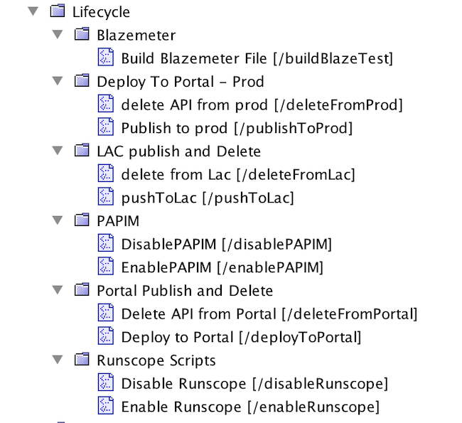
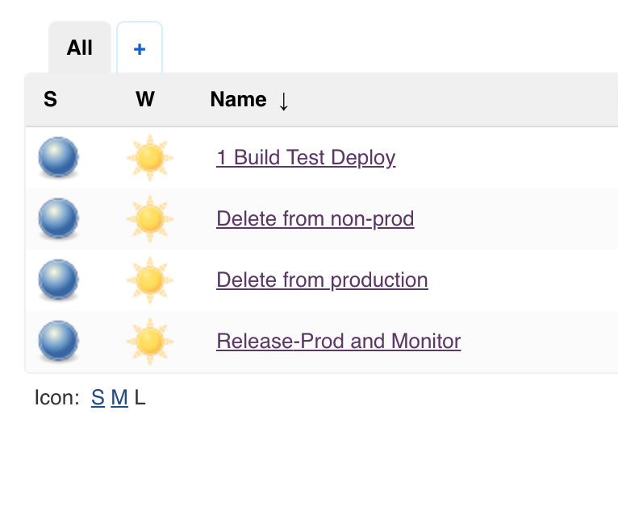
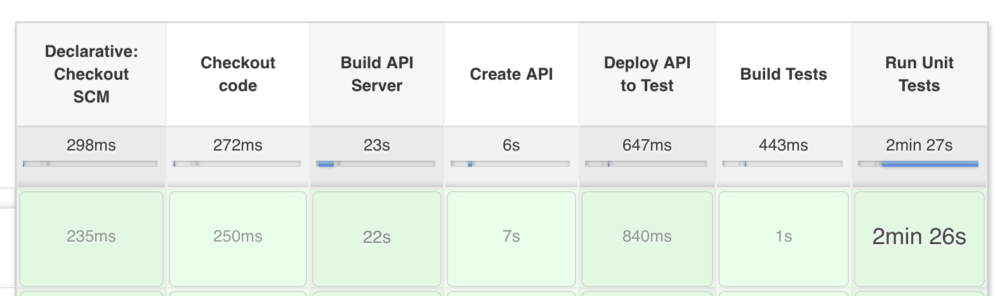
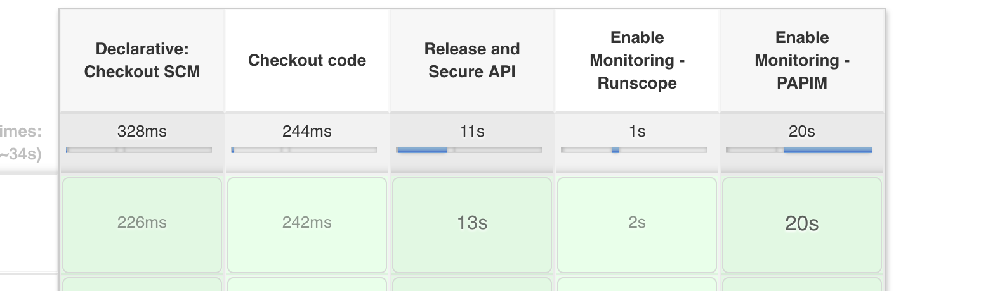

# api-lifecycle demo: Jenkins automated CA Portal deployment, test and migration

This CA API Portal demo integrates a Jenkins build pipeline with automated deployment, test and monitor of an API.

## This demo requires the following dependencies:
### [Blazemeter Account](https://a.blazemeter.com/app/sign-in/)
  * Performance testing a newly depoloyed DEV API

### [Runscope Account](https://www.runscope.com/)
  * Sythetic testing on PRODUCTION API (200 OK)

### [CA Precision API Monitoring](https://docops.ca.com/ca-precision-api-monitoring/3-3/en/)
  * Inside-Out monitor and debug for PRODUCTION API

### [CA Developer Portal 4.2.x](https://www.amazon.com/gp/help/customer/display.html?nodeId=201602060)
  * Developer portal integrated with both an 'AUTOMATIC' proxy and an 'ON_DEMAND' proxy integrated.

## Directory Contents
### .bzt-rc
    Blazemeter configuration file for reqiured automated testing
### Jenkinsfile
    Build instructions for AUTOMATIC(DEV) proxy deploy
### JenkinsfileProduction
    Build instructions for ON_DEMAND(PROD) proxy deploy
### swagger.json
    LAC swagger export of the to-be-created API
### docker-compose-mysql-4_1.yml
    Build file for Docker LAC instance and API creation
### input.schema
    Live API Creator export of requisite DB schema file used in API creation

## Getting Started Instructions
   * Please contact aric.day@ca.com for Jenkins configuration and gateway policy bundle
   * CA employees with Enterprise GitHub account can access missing artifacts [here](https://github-isl-01.ca.com/dayar02/lifecycle_demo)

   
#### Import Gateway Bundle

#### Configure Jenkins Jobs

#### Run Jenkins Jobs

**DEVELOPMENT**

**PRODUCTION**
